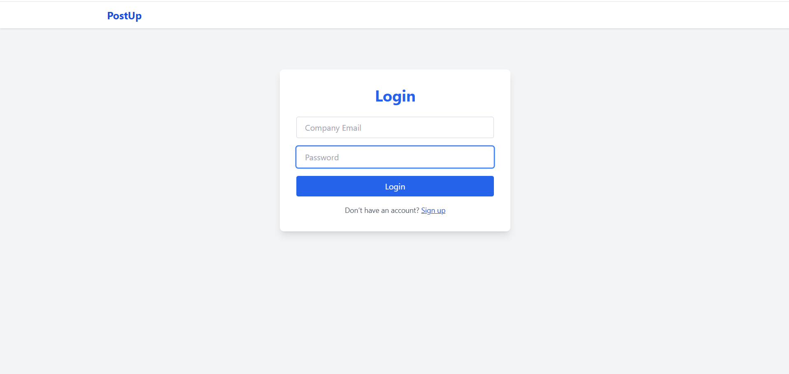
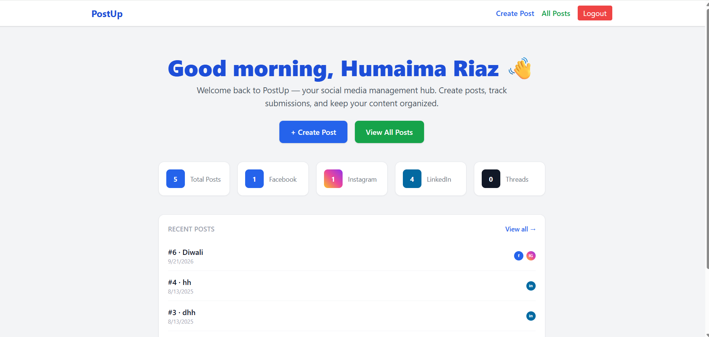
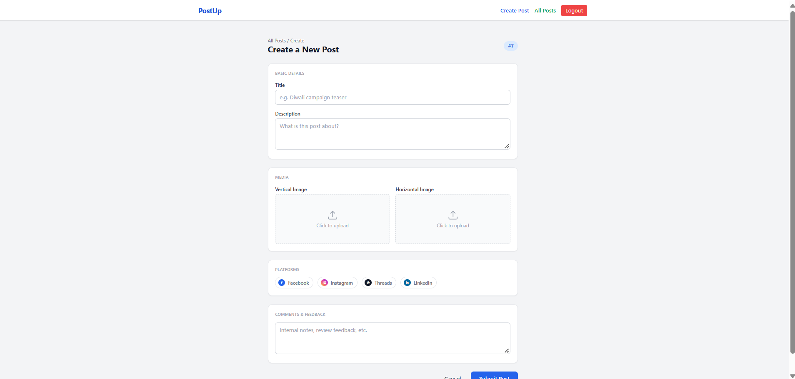
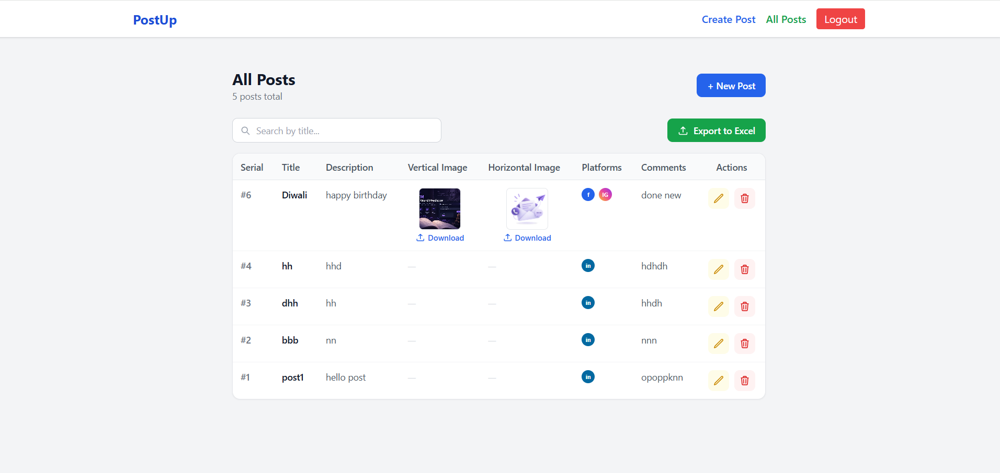

# PostUp – Social Media Content Management Dashboard

A full-stack social media content management and planning dashboard developed during my internship.

> ⚠️ **Important Note**
>
> This repository contains a **demo/portfolio version** of the application I worked on during my internship. It is **not the official production application** used by the organization.
>
> The official application and its production code/data are maintained and controlled by the organization and are **not included in this repository**.
>
> This project represents my implementation/demo version of the application and demonstrates the core workflows and concepts. The actual organizational application contains additional functionality, including an **admin panel and additional export/management features**, which are not part of this public repository.

---

## 📌 Overview

**PostUp** is a social media content planning and management dashboard designed to help users organize social media posts and their associated media assets in one place.

The application allows users to:

- Create social media posts
- Add post descriptions and comments
- Upload vertical and horizontal images
- Select target social media platforms
- View and search existing posts
- Edit existing posts
- Delete posts
- Download uploaded media
- Export post data to Excel
- View dashboard statistics
- Manage content through a simple web-based interface

The project was developed as part of my internship experience and is presented here as a **demonstration of the application concept and implementation**.

---

## 🎯 Project Purpose

The purpose of the application is to provide an organized workflow for managing social media content before publication.

Instead of maintaining post information across multiple files or tools, users can store content, images, platform information, and comments within a centralized dashboard.

The application focuses on **content organization and management** rather than directly publishing posts to social media platforms.

---

## ✨ Features

### 🔐 Authentication

- User signup
- User login
- Company-domain-based signup restriction
- Password hashing
- Login state management

### 📊 Dashboard

The dashboard provides an overview of the stored social media content.

It includes:

- Total number of posts
- Recent posts
- Quick access to create new posts
- Navigation to all posts

### 📝 Create Posts

Users can create new social media posts by providing:

- Post title
- Description
- Comments
- Social media platforms
- Vertical image
- Horizontal image

Supported platforms include:

- Facebook
- Instagram
- LinkedIn
- Threads

### 🔎 Search & Manage Posts

The application provides a searchable post inventory where users can:

- Search posts
- View post details
- Edit posts
- Delete posts
- Download images

### 📁 Media Management

Each post can contain different image formats suitable for different social media layouts.

The application supports:

- Vertical images
- Horizontal images
- Image storage
- Image preview
- Image downloading

### 📊 Excel Export

Post information can be exported into an Excel file.

The export functionality includes:

- Post information
- Platform information
- Comments
- Associated images

Images can be embedded into the generated spreadsheet.

### 📱 Platform Selection

Users can associate a post with multiple social media platforms:

```text
Facebook
Instagram
LinkedIn
Threads
````

> Platform selection in this demo is **metadata only**. The application does not directly publish content to these social media platforms.

---

# 🖥️ Application Screenshots

## Login



The login screen allows registered users to access the dashboard.

---

## Dashboard



The dashboard provides an overview of the application's content and recent posts.

---

## Create Post



Users can create new posts by adding text, images, comments, and target platforms.

---

## All Posts



The posts page provides a searchable list of existing social media content.

Users can view, edit, delete, and download post-related content.


# 🏗️ Tech Stack

## Frontend

* React.js
* Vite
* React Router
* JavaScript
* CSS

## Backend

* Node.js
* Express.js
* REST API
* Multer

## Database

* MongoDB
* Mongoose

## Other Technologies

* ExcelJS
* bcrypt
* Axios
* File uploads
* Local media storage

---

# 🏛️ Architecture

The project follows a simple full-stack architecture:

```text
                ┌─────────────────────┐
                │     React Frontend  │
                │       + Vite        │
                └──────────┬──────────┘
                           │
                           │ REST API
                           ▼
                ┌─────────────────────┐
                │   Node.js / Express │
                │       Backend       │
                └───────┬─────┬───────┘
                        │     │
              ┌─────────┘     └──────────┐
              ▼                          ▼
      ┌───────────────┐          ┌───────────────┐
      │    MongoDB    │          │  Uploads      │
      │   / Mongoose  │          │   Directory   │
      └───────────────┘          └───────────────┘
```

---

# 🔄 Application Workflow

```text
User
  │
  ▼
Login / Signup
  │
  ▼
Dashboard
  │
  ├───────────────┐
  │               │
  ▼               ▼
Create Post     View Posts
  │               │
  ▼               ├── Search
Add Content       ├── Edit
  │               ├── Delete
  ▼               └── Download
Upload Images
  │
  ▼
Select Platforms
  │
  ▼
Save Post
  │
  ▼
MongoDB
  │
  ▼
Export to Excel
```

---

# 📂 Project Structure

```text
postup-social-media-dashboard/
│
├── frontend/
│   ├── src/
│   │   ├── components/
│   │   ├── pages/
│   │   ├── App.jsx
│   │   └── main.jsx
│   │
│   ├── public/
│   ├── package.json
│   └── vite.config.js
│
├── backend/
│   ├── models/
│   ├── routes/
│   ├── controllers/
│   ├── uploads/
│   ├── server.js
│   └── package.json
│
├── screenshots/
│   ├── login.png
│   ├── dashboard.png
│   ├── create-post.png
│   ├── all-posts.png
│   └── excel-export.png
│
├── .gitignore
└── README.md
```

> The exact folder structure may vary depending on the final version of the project.

---

# ⚙️ Installation & Setup

## 1. Clone the Repository

```bash
git clone https://github.com/YOUR_USERNAME/postup-social-media-dashboard.git

cd postup-social-media-dashboard
```

---

# 🔧 Backend Setup

Navigate to the backend:

```bash
cd backend
```

Install dependencies:

```bash
npm install
```

Create a `.env` file:

```env
MONGO_URI=your_mongodb_connection_string
PORT=5000
```

Start the backend:

```bash
npm start
```

The backend should run on:

```text
http://localhost:5000
```

---

# 💻 Frontend Setup

Open another terminal and navigate to the frontend:

```bash
cd frontend
```

Install dependencies:

```bash
npm install
```

Start the development server:

```bash
npm run dev
```

The frontend will typically be available at:

```text
http://localhost:5173
```

---

# 🔑 Environment Variables

The backend requires the following environment variables:

```env
MONGO_URI=your_mongodb_connection_string
PORT=5000
```

Do **not** commit your `.env` file to GitHub.

Make sure `.gitignore` contains:

```gitignore
node_modules/
.env
uploads/
dist/
```

---

# 🔌 API Overview

The backend provides REST API endpoints for authentication and post management.

### Authentication

```text
POST /api/auth/signup
POST /api/auth/login
```

### Posts

```text
GET    /api/posts
POST   /api/posts
PUT    /api/posts/:id
DELETE /api/posts/:id
```

The backend also provides functionality for media uploads and Excel export.

---

# 📤 Export Functionality

One of the key features of the application is the ability to export social media content into an Excel spreadsheet.

The exported information can contain:

* Post title
* Description
* Comments
* Social media platforms
* Post images

This provides a convenient way for teams to review or share planned social media content.

---

# 🧑‍💻 Internship Context

This project was developed during my internship as a demonstration/implementation of an internal social media content management workflow.

The organization has its own **official application**, which is separate from this public repository.

### This repository is:

* A demo implementation
* A portfolio representation of my work
* A demonstration of the application's core workflow
* Intended for learning and showcasing development experience

### This repository is NOT:

* The organization's official production application
* The organization's production source code
* A copy of the organization's official database
* An official replacement for the organization's application

The production application remains under the organization's control.

The actual organizational version also contains additional functionality, including an **admin panel and additional export/management capabilities**.

---

# 🔒 Privacy & Intellectual Property

No private organizational data, production databases, credentials, API keys, or confidential information should be included in this repository.

This public version has been prepared as a demonstration of the application's functionality and development concepts.

If you are using this repository, please treat it as a portfolio/demo project and not as the official organizational software.

---

# 🚀 Future Improvements

Potential improvements for this demo include:

* Role-based authentication
* Admin dashboard
* JWT authentication
* Cloud image storage
* Advanced analytics
* Social media API integrations
* Direct social media publishing
* Scheduled posts
* Drag-and-drop content planning
* Improved search and filtering
* Cloud deployment
* Notification system
* Activity logs

---

# 📚 What I Learned

Through this project, I gained practical experience with:

* Full-stack web application development
* React and component-based architecture
* REST API development
* Node.js and Express
* MongoDB and Mongoose
* Authentication workflows
* File upload handling
* Image management
* Excel generation
* Frontend/backend integration
* CRUD operations
* Application architecture
* Building software for real organizational workflows

---

# 👩‍💻 Developer

**Humaima Riaz**

Computer Systems Engineering Graduate
AI / Machine Learning / Full-Stack Development

GitHub:
[https://github.com/HumaimaRiaz47](https://github.com/HumaimaRiaz47)

---

# 📄 License

This project is provided for educational and portfolio purposes.

The repository does not contain the official organization's production application or proprietary production data.
